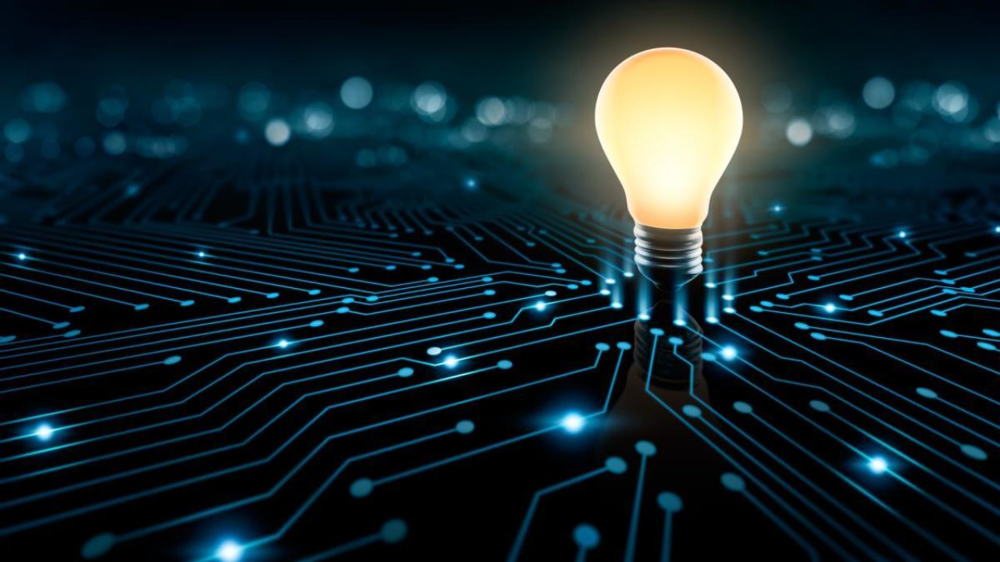

# House-hold-electrice-power-consumptiuon_LSTM
 

## A Machine learing project. 

In our Introduction to Machine Learning Methods and Data Mining course, We have learnt about the Grammar of Machine Learing,specially data analysis, data preprocessing, data visualization and creating model that make prediction with a impressive accuracy.In this workshop, we try to analyse House-hold-electrice-power-consumptiuon data using ML.

We have completed our workshop within two step, 
1. First we analysis the data
2. We use RNN(LSTM) model to make prediction.

Our forcasting models can help to optimize the overall supply chain of the household power industry.

Here, you'll find the House-hold-electrice-power-consumptiuon data which I have used for this workshop:

https://archive.ics.uci.edu/ml/datasets/individual%2Bhousehold%2Belectric%2Bpower%2Bconsumption

# Software and Files

For this project,I did following set-up:

1. Download Python
2. Download Visual studio code and Jupyternote book in extension
3. Install some python packages(e.g.Tensorflow)

To try this project, you'll need to download this repository after completing the third step.

4. Open the project by clicking `main.ipynb` and download the dataset and extract it from the given link.

Or yo can also run this notebook on jupyter notebook or google colab

6.Packages

### Reference

Data Reference    
https://archive.ics.uci.edu/ml/datasets/individual%2Bhousehold%2Belectric%2Bpower%2Bconsumption

### Thank you